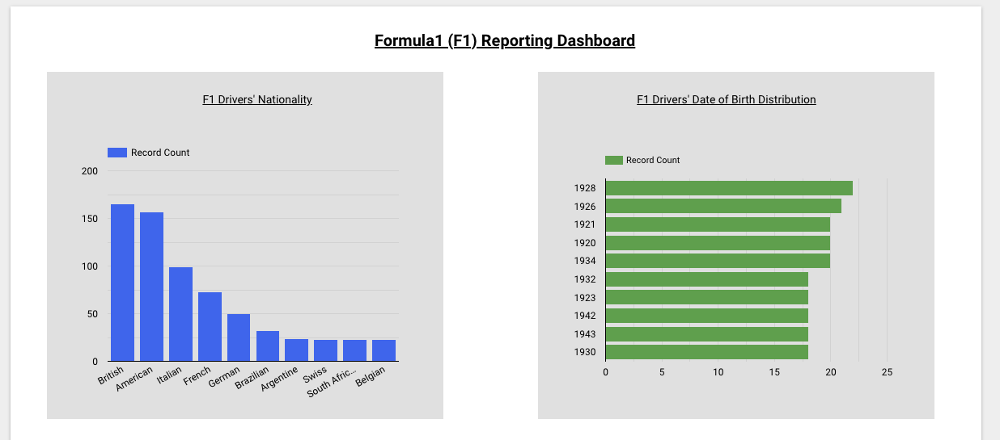

# DE Zoomcamp Final Project Plan

**Agenda** 

* In this project, we will be using the a dataset from [The Ergast Developer API](http://ergast.com/mrd/) that provides a historical record of motor racing data for non-commercial purposes. We will be calling this API to request data about Formula1 (F1) drivers. 

* After retrieving the driver data in a JSON format, we will convert it into a csv file called `drivers.csv` and put it in our Google Cloud Storage (GCS) data lake. This will be done using  `ingest_drivers.py` located in the `dags` directory. The `drivers.csv` file will then be pushed into Google Bigquery as Native Table using `gcs_to_bq_drivers.py`. 

* Both these scripts will be orchestrated using Airflow running on a docker container. The Airflow DAG, `airflow_dag.py` will be run on a weekly cadence. 

* All these scripts are located in the `/airflow/dags/`

* Our data will be visualised using Google Data Studio which will call our Bigquery table. The report will be refreshed also on a weekly cadence. Sample report; 

**Data Schema**

| FieldName      | Type	   	|
| -----------    | -----------	|
| driverId       | INTEGER   	|
| url            | STRING 		|
| givenName      | STRING 		| 
| familyName     | STRING 		|
| dateOfBirth    | DATE 		| 
| nationality    | STRING 		| 
| permanentNumber| INTEGER 	| 
| code 			  | STRING 		| 

**Project reproducability**
1. `cd` to the directory `/airflow/`, which contains DAGs, Dockerfile & docker-compose.yml file. 
2. Enter into your command line `docker-compose build` followed by `docker-compose up`. This will launch airflow at http://localhost:8081
	- username: airflow
	- password: airflow
3. Google Data Studio Dashboard link: https://datastudio.google.com/s/iVqdosq60ow
